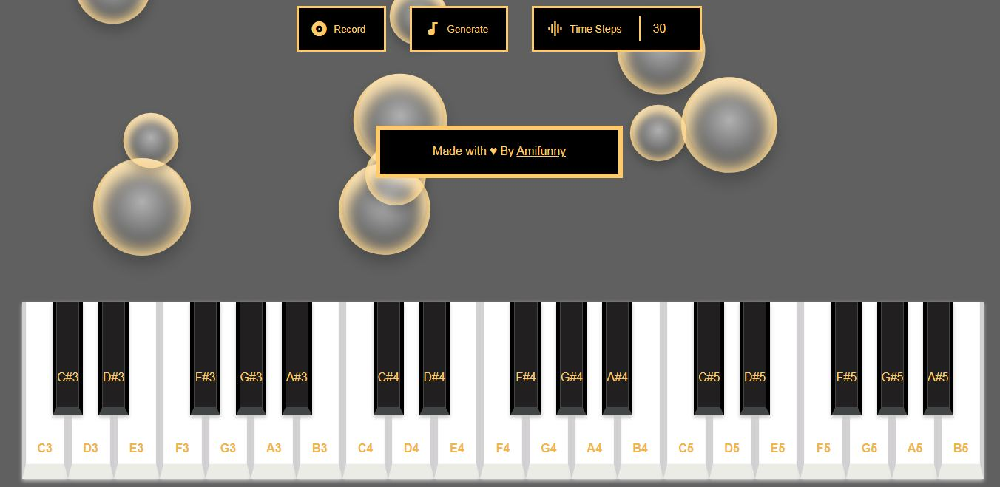

# Piano-Synth
A Bubbly-Virtual Piano with auto-generated key assist using deep learning.

## How to Use
1.  Clone the repo using  `git clone https://github.com/amifunny/Piano-Synth.git`  in the command line.
2.  In the command line, go inside the folder and use  `set FLASK_APP=backend`  for windows or to avoid setting this, change  `backend.py`  to  `app.py`.
3.  Start the local server using  `flask run`
4.  Go to  `http://127.0.0.1:5000/`  to interact with the demo.
5. Click `Record` Button and Play some notes on the piano.
6. After stopping recording, Click `Generate` to autoplay predicted tunes and download MIDI file

## Dataset
[Classical Music dataset](https://www.kaggle.com/soumikrakshit/classical-music-midi) is used from Kaggle with over 7Mb of classical MIDI files. 

## Model
Three GRU layers were used for building the music model in `model/` folder. The training was roughly based on this python notebook of mine [Music_Gen.ipynb](https://github.com/amifunny/Deep-Learning-Notebook/blob/master/Music_gen.ipynb).

[Music21 library](https://web.mit.edu/music21/doc/) was used for creating midi files and processing music notes and chords.

**Do provide feedback on the quality of music being generated or demo working issues if any.**
